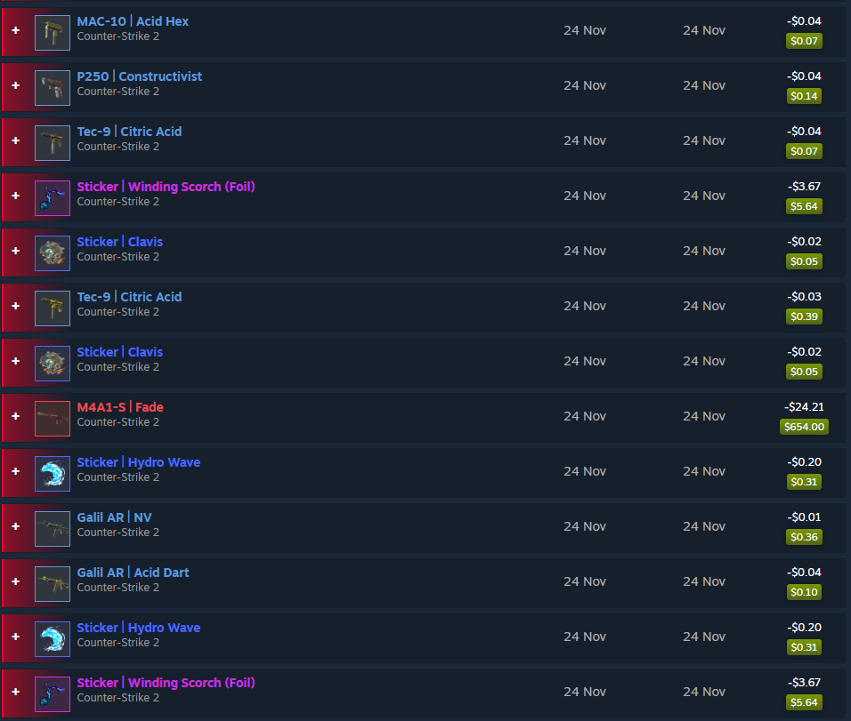

# BuyOrderBot
```
High-performance bot for placing Buy Orders on Steam Community Market (CS2, DOTA2, RUST, TF2).
```

This bot is a fast and asynchronous Python-based automation tool designed to place buy orders on Steam Community Market items with minimal latency.

If you are interested in learning more or need help with a setup, feel free to contact me **@bravemacaque** on [Discord](https://discord.com/users/1076922097441447977).

## Features
* Multi-account support, allows you to place more buy orders from multiple accounts;
* Doesn't require a Steam API key;
* Using cookies for authentication and storing them safely on your machine;
* HTTPS/SOCKS Proxy support to handle Steam rate limit and maintain stability;
* Various game support: **CS2, DOTA2, RUST, TF2**, etc;
* Proper logging and messaging with the user;
* Simple configuration and easy user experience;

You just run the script when needed, and it automatically places buy orders on desired items as they appear on the Market.

📺 **Live demo of the bot in action:**
[YouTube video](https://youtu.be/KiE8SWaq2ak?si=lnj-2OKGFMQ_iv4u).

Screenshots of successful purchases are listed in [screenshots](./screenshots) folder.
